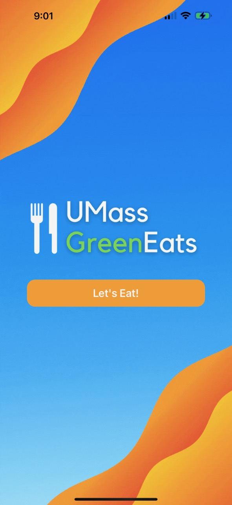
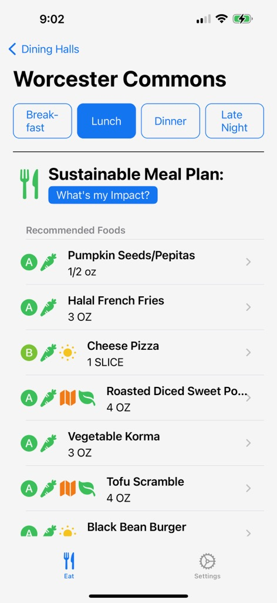
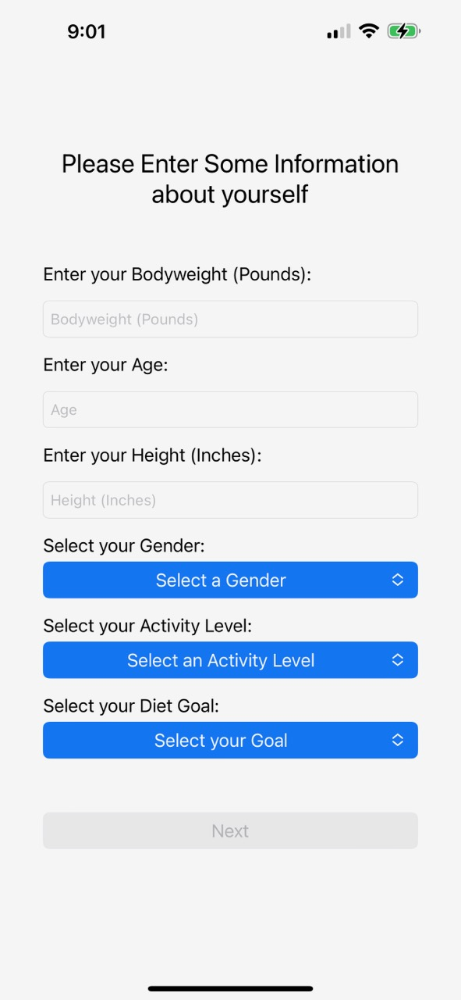

# UMass-Dieting

## Inspiration 🍃
Human activity in the last 500 years has brought extinction upon more than 800 species. 
Up to 200 million people could be displaced by climate change by 2050. 
Global average sea level has risen 8–9 inches (21–24 centimeters) since 1880.

There is no question that we need to do a better job at maintaining our home. With the explosion of social media, the internet, and software, our best bet is right in our pockets. Our application is built upon the premise of utilizing mobile technology to make educated, calculated, and sustainable decisions. So, we started with the UMass Community. With food accounting for over 25% of greenhouse gas emissions, we developed an application that strategically builds sustainable, healthy, personalized meal plans for students on campus.

A statement from UMass: 
“As a global leader in research, entrepreneurship, and innovation, UMass Amherst must seize our unparalleled opportunity to limit the climate crisis in our own community and throughout the world and to educate the next generation of leaders in sustainability.” (https://www.umass.edu/carbon-neutrality/)

## What it does 📱

### Summary

As previously mentioned UMass GreenEats strategically builds sustainable, healthy, and personalized meal plans for students on campus. It takes in users age, height, weight, gender, goals, activity level, dietary restrictions, and preferences. Our server-side engineers utilized various tools and technologies to scrape UMass dining information for any UMass Amherst dining hall and any meal (it includes a full list of foods available along with their carbon rating, healthfulness, nutritional information, and ingredients). Our server-side engineers also developed an algorithm to take into account all of the user specified parameters, and all of the foods available to create a meal plan for the user, prioritizing meals with lower carbon dioxide emissions. This meal plan is presented to the user through the iOS application interface, where they can view the full meal plan along with all supporting information.

### Full Flow

Users of UMass GreenEats start by entering  information about themselves (age, gender, height, weight, exercise goals, activity level), which is then used to calculate the necessary amount of calories for that person. They can then enter any dietary restrictions/preferences that they have (vegetarian, halal, local-only, etc). Now they are taken to the main user flow.

Users are presented with a list of dining halls (Worcester, Berkshire, Hampshire, Franklin). They can tap on any of these options, and a request to our server will be made to calculate a sustainable meal plan algorithmically for the current time (more on the algorithm later). Users can then see the sustainable meal plan laid out for them in the form of a list of foods. All of the listed food items are labeled with icons that specify carbon rating, vegetarian, local, etc. If a user clicks on a specific food, they are taken to a screen where they can see a full nutrition label and list of ingredients.

Users can “switch tabs” to see sustainable meal plans for different times of the day (breakfast, lunch, dinner, late night).

Users can also see a full list of foods available at the dining hall if they are unsatisfied with their recommendation and would like to view nutritional and sustainability information independently.

### Carbon Dioxide Emissions 🌳

Most importantly, users can see the total amount of carbon dioxide emissions (gCO2e) they are saving from entering the stratosphere and o-zone layer, given by the recommended meal. 

To do this, our team did extensive research into UMass Dining’s sustainability provider, MyEmissions (https://myemissions.green/), and reverse engineered the carbon footprint rating from their website to calculate an estimation of the average carbon dioxide emission (gCO2e) per food serving. 

## How we built it 👨‍💻

Our system has a lot of moving parts, so stick with us.

### Client

The frontend of our application is an iOS App built in Xcode with Swift 5 and UIKit (as well as Storyboard for efficiency). It utilizes the MVC design pattern to provide the user with the interfaces specified above. We used a REST API approach and used URLSession to make HTTPS requests to our backend.

### Backend and Scraping

For our API, we used an Express.js application which is hosted on Google Cloud’s Firebase, using Google Cloud Functions (serverless), and Google Cloud Firestore Database (NoSQL). 

For our scraper, we used AWS to host a separate Express js application on an AWS EC2 instance to run a selenium python script to scrape data on a 24-hour cron job basis.

## Challenges we ran into ⛰️

### Lack of Support for Python / Selenium within Google Cloud Functions

Initially, our team planned to run our web scraper within Google Cloud, but after extensive debugging and research, we found out that Selenium / Python was not supported within our serverless Google Cloud Function. Our team had to adjust accordingly and quickly to build a separate server on an AWS EC2 instance solely for scraping, and injecting it into our Google Cloud Firestore database.

### Integration

One of the biggest challenges that we ran into was integration. In other words, using URLSession on our client to send requests to our backend, receive responses, and then translate those responses into digestible object models. We ran into various issues with “data-wrangling”, where food items were missing certain fields which caused inconsistencies in our data. 
We solved this issue by utilizing the debugging tools at our disposal and budgeting time for our client and server-side engineers to collaborate and come to a consensus on data-formatting.

## Accomplishments that we're proud of

We're very proud of our use of multiple cloud services. Although it was a bummer to find out that our scraper was incompatible with Google Cloud Functions, we were still persistent on getting it to run on the cloud. I believe it was a great accomplishment to work around this roadblock by incorporating AWS alongside Google Cloud.

We're also very proud of our iOS frontend. A lot of work went into designing, mocking, and storyboarding to make our app look exactly the way that we wanted it to. 

## What we learned 📚

**Lesson 1: Communication is Key.**
We learned how to efficiently collaborate as a team and divide work in a way that made sense and logical. Questions and clarifications were important, especially at the beginning of development and it helped us a lot.

**Lesson 2: Integrate Early.** Having some prior experience working with projects in the past, we prioritized starting the integration phase early. Creating a design document with all of the schemas, data fields, and API endpoints would benefit us later down the road. 

**Lesson 3: Incremental Development.** We found success by developing incrementally, one step at a time. This meant testing a feature before moving onto the next one. By breaking down big tasks into smaller sub-tasks, we were able to see our app progress over the 36 hours.

## What's next for UMass GreenEats ➡️

Our plan for what's next for UMass GreenEats will eventually be to:
* UI improvements  
* Algorithmic improvements with runtime and caching
* Feature for tracking meals and analytics

Overall, there was a lot of cup ramen, coffee, and junk food that allowed us to keep on coding. Thank you again to all of our sponsors - and as a team of all graduating seniors, (we'll keep on hacking :) ).
